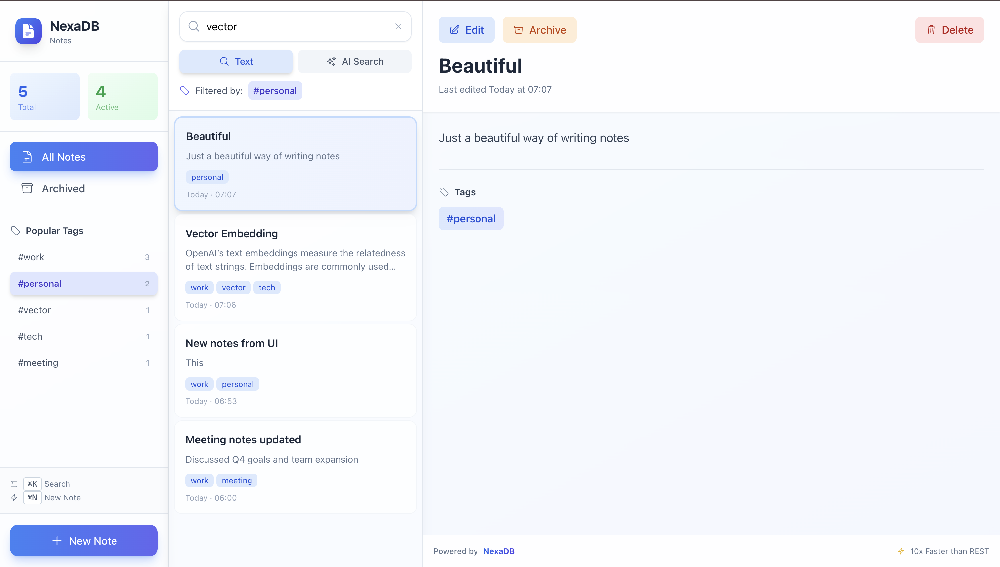

# NotesApp - Beautiful Notes with NexaDB

A production-ready, full-stack note-taking application showcasing NexaDB 3.0 features with a stunning modern UI.



## Features

### Backend (FastAPI + NexaDB)
- **Binary Protocol** - 10x faster than REST using MessagePack
- **CRUD Operations** - Create, read, update, delete notes
- **Vector Search** - AI-powered semantic similarity search
- **Text Search** - Fast full-text search in titles and content
- **Tag Management** - Organize notes with tags
- **Bulk Operations** - Create/delete multiple notes at once
- **Statistics** - Real-time aggregated stats
- **Archiving** - Archive/restore notes
- **Pagination** - Efficient handling of large datasets

### Frontend (React + TypeScript + Tailwind)
- **Modern UI** - Beautiful three-column layout inspired by Notion
- **Keyboard Shortcuts** - ⌘K for search, ⌘N for new note
- **Auto-Search** - Debounced search with instant results
- **Smooth Animations** - Fade-in, slide-in effects throughout
- **Loading States** - Elegant skeleton screens
- **Toast Notifications** - Success/error feedback
- **Tag Filtering** - Click any tag to filter notes
- **Responsive Design** - Works on all screen sizes
- **Glass Morphism** - Modern frosted glass effects

## Quick Start

```bash
# 1. Start NexaDB (from NexaDB root directory)
python3 nexadb_binary_server.py &

# 2. Start the API (from examples/NotesApp)
python3 main.py &

# 3. Start the UI (from examples/NotesApp/ui)
cd ui
npm install
npm run dev
```

**Open in browser:**
- 🌐 **Web UI**: http://localhost:5174
- 📚 **API Docs**: http://localhost:8000/docs
- 🔌 **API**: http://localhost:8000

## Architecture

```
┌─────────────────────┐
│   React Web UI      │  Port 5174
│   Vite + TypeScript │
│   + Tailwind CSS    │
└──────────┬──────────┘
           │
           │ HTTP/JSON REST API
           │
┌──────────▼──────────┐
│   FastAPI Backend   │  Port 8000
│   Notes API + CORS  │
└──────────┬──────────┘
           │
           │ MessagePack Binary Protocol
           │ ⚡ 10x faster than REST
           │
┌──────────▼──────────┐
│   NexaDB Server     │  Port 6970
│   Binary Protocol   │
└─────────────────────┘
```

## Installation

### Prerequisites
- Python 3.11+
- Node.js 18+ and npm
- NexaDB server running

### Backend Setup

```bash
# Navigate to NotesApp directory
cd examples/NotesApp

# Install Python dependencies
pip3 install fastapi uvicorn

# Optional: Configure environment
cp .env.example .env
# Edit .env if needed (defaults work for local development)
```

### Frontend Setup

```bash
# Navigate to UI directory
cd ui

# Install dependencies
npm install

# For production build
npm run build
npm run preview
```

## Usage

### Running the Application

**Development Mode** (recommended for testing):
```bash
# Terminal 1: Start NexaDB
cd /path/to/nexadb
python3 nexadb_binary_server.py

# Terminal 2: Start API
cd examples/NotesApp
python3 main.py

# Terminal 3: Start UI
cd examples/NotesApp/ui
npm run dev
```

**Production Mode**:
```bash
# API with Gunicorn
gunicorn main:app \
  --workers 4 \
  --worker-class uvicorn.workers.UvicornWorker \
  --bind 0.0.0.0:8000

# UI (build and serve)
cd ui
npm run build
npm run preview
```

### Using the Web Interface

#### Keyboard Shortcuts
- **⌘K** / **Ctrl+K** - Focus search
- **⌘N** / **Ctrl+N** - Create new note
- **Escape** - Clear search/filters

#### Creating Notes
1. Click "New Note" button (or press ⌘N)
2. Edit the title and content
3. Add tags (comma-separated)
4. Click "Save"

#### Searching Notes
- **Text Search**: Type in search box for instant results
- **AI Search**: Toggle to "AI Search" for semantic similarity
- **Tag Filter**: Click any tag to filter notes

#### Managing Notes
- **Edit**: Select note, click "Edit" button
- **Archive**: Click "Archive" to archive (or "Restore" to unarchive)
- **Delete**: Click "Delete" (confirmation required)

## API Endpoints

### Core Operations

| Method | Endpoint | Description |
|--------|----------|-------------|
| GET | `/` | Health check |
| POST | `/notes` | Create note |
| GET | `/notes` | List notes (with pagination) |
| GET | `/notes/{id}` | Get single note |
| PUT | `/notes/{id}` | Update note |
| DELETE | `/notes/{id}` | Delete note |

### Search & Discovery

| Method | Endpoint | Description |
|--------|----------|-------------|
| GET | `/notes/search?q=query` | Text search |
| POST | `/notes/vector-search` | Semantic search |
| GET | `/notes/recent?limit=10` | Recent notes |
| GET | `/notes/tags/{tag}` | Notes by tag |

### Statistics & Bulk

| Method | Endpoint | Description |
|--------|----------|-------------|
| GET | `/notes/stats` | Get statistics |
| POST | `/notes/bulk` | Bulk create |
| DELETE | `/notes/bulk` | Bulk delete |
| GET | `/notes/archived` | Archived notes |
| POST | `/notes/{id}/archive` | Archive/restore |
| POST | `/notes/{id}/tags` | Add tags |

See the [full API documentation](http://localhost:8000/docs) when running.

## Configuration

### Environment Variables

```bash
# .env file
NEXADB_HOST=localhost
NEXADB_PORT=6970
NEXADB_USERNAME=root
NEXADB_PASSWORD=nexadb123
```

### CORS Configuration

The API allows requests from:
- `http://localhost:5174` (Vite dev server)
- `http://localhost:5173` (Alternative Vite port)

Update `main.py` to add more origins:
```python
app.add_middleware(
    CORSMiddleware,
    allow_origins=["http://your-domain.com"],
    allow_credentials=True,
    allow_methods=["*"],
    allow_headers=["*"],
)
```

## Tech Stack

### Backend
- **FastAPI** - Modern Python web framework
- **NexaDB** - High-performance database with binary protocol
- **Uvicorn** - ASGI server
- **Pydantic** - Data validation

### Frontend
- **React 18** - UI library
- **TypeScript** - Type-safe JavaScript
- **Vite** - Fast build tool with HMR
- **Tailwind CSS 3** - Utility-first CSS
- **Heroicons** - Beautiful icons

## Performance

### MessagePack Binary Protocol
- **10x faster** than REST API
- Lower latency for all database operations
- Efficient binary serialization
- Reduced bandwidth usage

### Frontend Optimizations
- Debounced search (500ms)
- Lazy loading
- Efficient re-renders
- Optimized bundle size

## Development

### Project Structure
```
NotesApp/
├── main.py              # FastAPI application
├── requirements.txt     # Python dependencies
├── .env.example        # Environment template
├── ui/                 # React frontend
│   ├── src/
│   │   ├── App.tsx     # Main component
│   │   ├── api/        # API client
│   │   ├── types/      # TypeScript types
│   │   └── index.css   # Styles
│   ├── package.json
│   └── vite.config.ts
└── README.md           # This file
```

### Running Tests

```bash
# Backend tests
pytest tests/

# Frontend tests
cd ui
npm test
```

### Linting & Formatting

```bash
# Python
black main.py
ruff check .

# TypeScript
cd ui
npm run lint
npm run format
```

## Deployment

### Docker

```bash
# Build and run with Docker Compose
docker-compose up -d

# Or build manually
docker build -t notesapp-api .
docker run -p 8000:8000 notesapp-api
```

### Production Checklist
- [ ] Set strong passwords in environment variables
- [ ] Configure proper CORS origins
- [ ] Enable HTTPS
- [ ] Use production embedding model (OpenAI, Cohere, etc.)
- [ ] Set up monitoring and logging
- [ ] Configure backup strategy
- [ ] Implement rate limiting
- [ ] Add authentication if needed

## Customization

### Using Real Embeddings

Replace the `generate_embedding()` function in `main.py`:

```python
# Using OpenAI
import openai

def generate_embedding(text: str) -> List[float]:
    response = openai.Embedding.create(
        input=text,
        model="text-embedding-ada-002"
    )
    return response['data'][0]['embedding']

# Using Sentence Transformers
from sentence_transformers import SentenceTransformer

model = SentenceTransformer('all-MiniLM-L6-v2')

def generate_embedding(text: str) -> List[float]:
    return model.encode(text).tolist()
```

### Theming the UI

Edit `ui/src/index.css` to customize colors:

```css
/* Custom color scheme */
:root {
  --primary: #3b82f6;
  --secondary: #8b5cf6;
  --accent: #06b6d4;
}
```

## Troubleshooting

**Cannot connect to NexaDB**
```bash
# Verify NexaDB is running
lsof -i :6970

# Start NexaDB if not running
python3 nexadb_binary_server.py
```

**CORS errors in browser**
- Check API server is running on port 8000
- Verify CORS middleware configuration in `main.py`
- Make sure UI is accessing `http://localhost:8000`

**UI not loading**
```bash
# Clear node_modules and reinstall
cd ui
rm -rf node_modules package-lock.json
npm install
npm run dev
```

**Import errors**
```bash
# Add NexaDB Python client to PYTHONPATH
export PYTHONPATH=/path/to/nexadb/nexadb-python:$PYTHONPATH
```

## Learn More

- [NexaDB Documentation](https://github.com/krishcdbry/nexadb)
- [FastAPI Documentation](https://fastapi.tiangolo.com/)
- [React Documentation](https://react.dev/)
- [Tailwind CSS](https://tailwindcss.com/)

## Contributing

Contributions are welcome! Please:
1. Fork the repository
2. Create a feature branch
3. Make your changes
4. Submit a pull request

## License

This example is part of the NexaDB project.

## Support

- GitHub Issues: [Report bugs](https://github.com/krishcdbry/nexadb/issues)
- Documentation: [NexaDB Docs](https://github.com/krishcdbry/nexadb)
- Community: Join our Discord (coming soon)

---

**Built with ❤️ using NexaDB 3.0**
